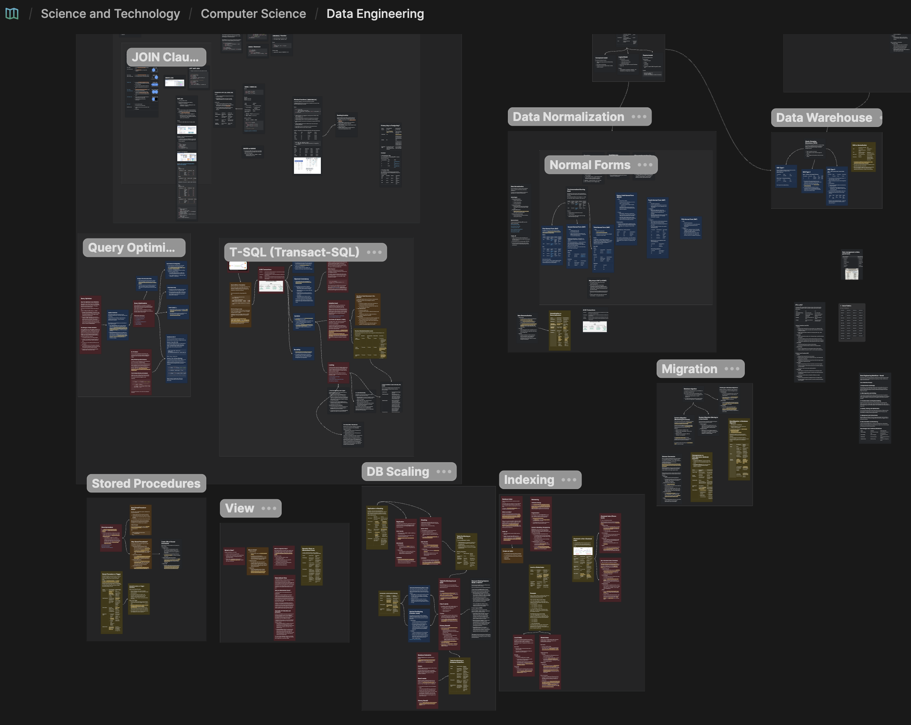

## Über diesen Beitrag

Ich mache jetzt einen Versuch, meinen Lernfortschritt regelmäßig festzuhalten, markiert mit #LazyUpdate.

Diese Woche habe ich versucht, mein Wissen rund um Datenbanken aufzufrischen und zu ordnen, das ich (größtenteils) vor etlichen Jahren gelernt habe.

---

**TL;DR** — Vier Tage (24.–27. August 2026), 79 neue Karten auf meinem Data-Engineering-Whiteboard, grob in Abhängigkeitsreihenfolge bearbeitet: Schlüssel → Normalisierung → Modellierung → Migration → Skalierung → Query-Optimierung → Nebenläufigkeit → Views.

*Das Data-Engineering-Whiteboard am Ende der Woche — die Sektionen entsprechen grob den Kategorien unten.*

## Schlüssel & Constraints (4)

- Primary Key vs. Foreign Key?
- Superkey
- Candidate Key
- Warum der Superkey für BCNF wichtig ist

## Normalisierung & Denormalisierung (4)

- Der unnormalisierte Ausgangspunkt
- Normalisierung vs. Denormalisierung
- Denormalisierung von Daten
- Warum bei 3NF (bzw. BCNF) aufhören

## Datenmodellierung (4)

- Datenmodellierung
- Konzeptuelles Modell
- Logisches Modell
- Physisches Modell

## Slowly Changing Dimensions (5)

- Slowly Changing Dimensions (SCD)
- SCD Typ 1
- SCD Typ 2
- SCD Typ 3
- SCD vs. Normalisierung

## Indizierung (9)

- Datenbankindex
- Einen Index anlegen
- Reindizierung
- Clustered Index (Telefonbuch)
- Non-Clustered Index (Lehrbuch)
- Clustered vs. Non-Clustered Index
- Local Index
- Global Index
- Local vs. Global Index

## Datenbankmigration (7)

- Datenbankmigration
- Datenmigration vs. Datenbankmigration
- Herausforderungen bei Datenbankmigrationen
- Schema-Konvertierung
- Homogene vs. heterogene Datenbankmigration
- Schema-Migration (Das Haus renovieren)
- System-Migration (In ein neues Haus ziehen)

## Stored Procedures & Trigger (6)

- Stored Procedure
- Warum Stored Procedures?
- Wie funktionieren Stored Procedures?
- Trade-offs von Stored Procedures
- Stored Procedure vs. Trigger
- Stored Procedure vs. Trigger — Szenarien

## Skalierung: Sharding, Replikation, Partitionierung, Föderation (11)

- Sharding
- Replikation
- Replikation vs. Sharding
- Datenbank-Föderation
- Tabellenpartitionierung (lokale Aufteilung)
- Tabellenpartitionierung vs. Datenbank-Föderation
- Tabellenpartitionierung vs. Sharding
- Horizontale vs. vertikale Partitionierung
- Horizontale Partitionierung (Zeilenebene)
- Vertikale Partitionierung (Spaltenebene)
- Verbessert Partitionierung READ oder WRITE?

## Query-Optimierung (9)

- Query-Optimierung
- Query Optimizer
- Den Ausführungsplan analysieren
- Indizes gezielt einsetzen
- `SELECT *` vermeiden
- Daten früh filtern
- Statistiken aktualisieren
- N+1-Problem
- Lösungen für N+1

## Transaktionen & ACID (7)

- Transaktion
- Wie man eine Transaktion schreibt
- Atomarität („Alles oder nichts")
- (System-)Konsistenz
- Fachliche Konsistenz
- Isolation
- Dauerhaftigkeit (Durability)

## Isolationsstufen & Sperren (8)

- Isolationsstufe
- Die vier Standard-Isolationsstufen
- Die drei „Read Phenomena" (die Störeffekte)
- Locking
- Die zwei primären Sperrtypen
- Sperrgranularität
- Wie Isolationsstufen Sperren tatsächlich nutzen
- Der Nebeneffekt: Deadlocks

## Views (5)

- Wozu Views?
- Was ist ein View?
- Was ist ein Dynamic View?
- Dynamic Views vs. Materialized Views
- Materialized View
