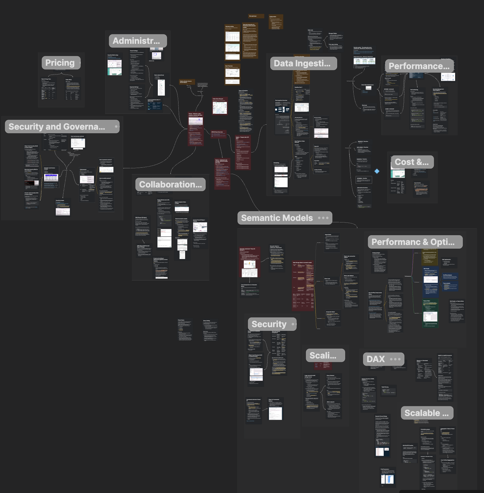
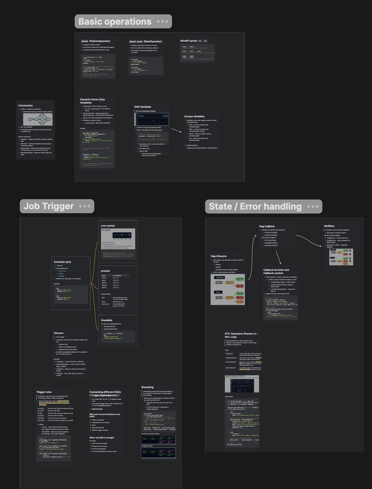

Last week I passed my DP-600 exam for Microsoft Fabric. I basically followed my usual study method: go through the official Microsoft study guide [\[1\]][1] point by point, revise each one, and for every point drop the key concepts as cards into Heptabase. Topics covered Data Ingestion, Semantic Models, DAX syntax, Scaling, Performance and Optimization, etc., which correspond to the end-to-end data lifecycle [\[2\]][2] in Fabric.

Besides, I also went through an Airflow fundamentals course on DataCamp. Airflow is essentially a Python-based ETL framework. This course taught the basic pipeline construction, triggers, scheduling, dynamic variable and templating, DAG lifecycle, error handling, etc.

[1]: https://learn.microsoft.com/en-us/credentials/certifications/resources/study-guides/dp-600
[2]: https://learn.microsoft.com/en-us/fabric/fundamentals/data-lifecycle
